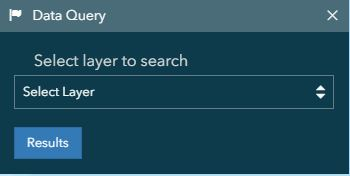

[Live Demo](https://htmlpreview.github.io/?https://github.com/FREAC/LABINS/blob/master/index.html)

# LABINS (Land Area Boundary Information System) WebMap

The Land Boundary Information System or LABINS was developed by the Florida Department of Environmental Protection to provide information regarding to surveying and mapping for horizontal and vertical control information across the State of Florida. 

The Florida Department of Environmental Protection, Division of State Lands, Bureau of Survey and Mapping, has contracted with the Florida Resources and Environmental Analysis Center at the Florida State University, to collect the attendant data from Federal, State, and local agencies for use by the private sector.

This WebMap is created as an update to the previous [version](http://labins.org/map/index.html) to utilize the JavaScript API for ArcGIS.

# Table of Contents
- [What data is available?](#what-data-is-available)
- [How to find data:](#how-to-find-data)
- [Information Panel](#information-panel)
  - [Zoom to feature](#zoom-to-feature)
  - [Data Query](#data-query)
  - [Drill Down Identify](#drill-down-identify)
  - [Search Widget](#search-widget)
- [Accessory Functionality](#accessory-functionality)

<!-- toc -->

## What data is available?

We need a table of what data we can find

## How to find data?

### Information Panel

### Zoom to Feature

The user is able to zoom to different features within the map.

This tool will only zoom to the boundary polygons of the feature selected. **No data will be selected**

**Zoom to Township/Range/Section**  
  - Map will zoom once Township/Range dropdowns are filled.
  - Map will zoom when Township/Range/Section is filled.

  - Section choices will reset each time another Range is selected
  - Section and Range will reset each time a township is selected

### Data Query

Select layer to query:

Select field from which to return all data within polygon or search by name/ID:

### Drill-Down Identify

Finds any data from all visible layers under a mouseclick. Resulting data is then fed to the Information Panel (popup).

### Search Widget

Allows the user to do either a global or a layer specific search to find a desired feature.

